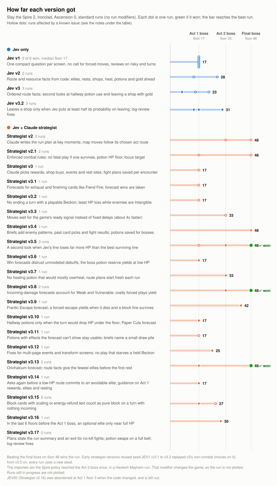
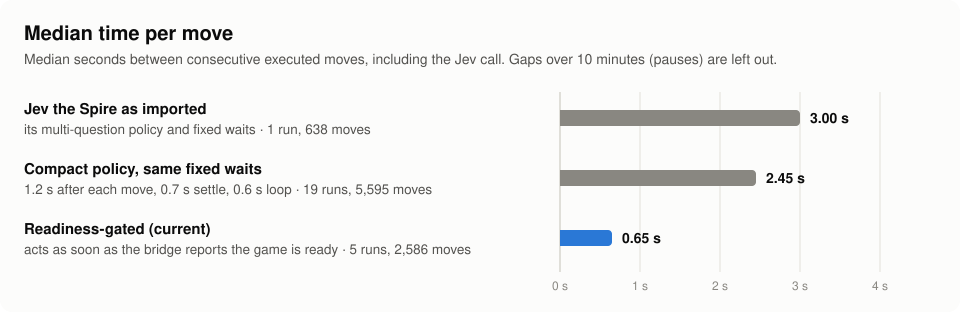
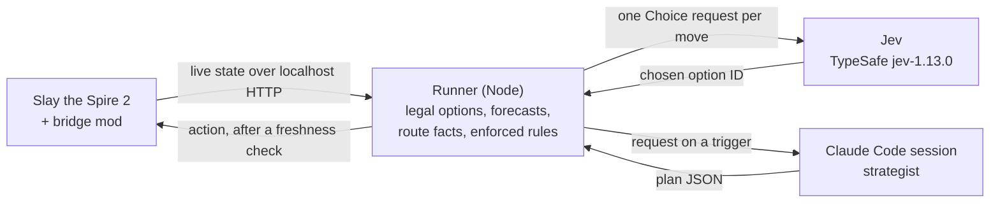
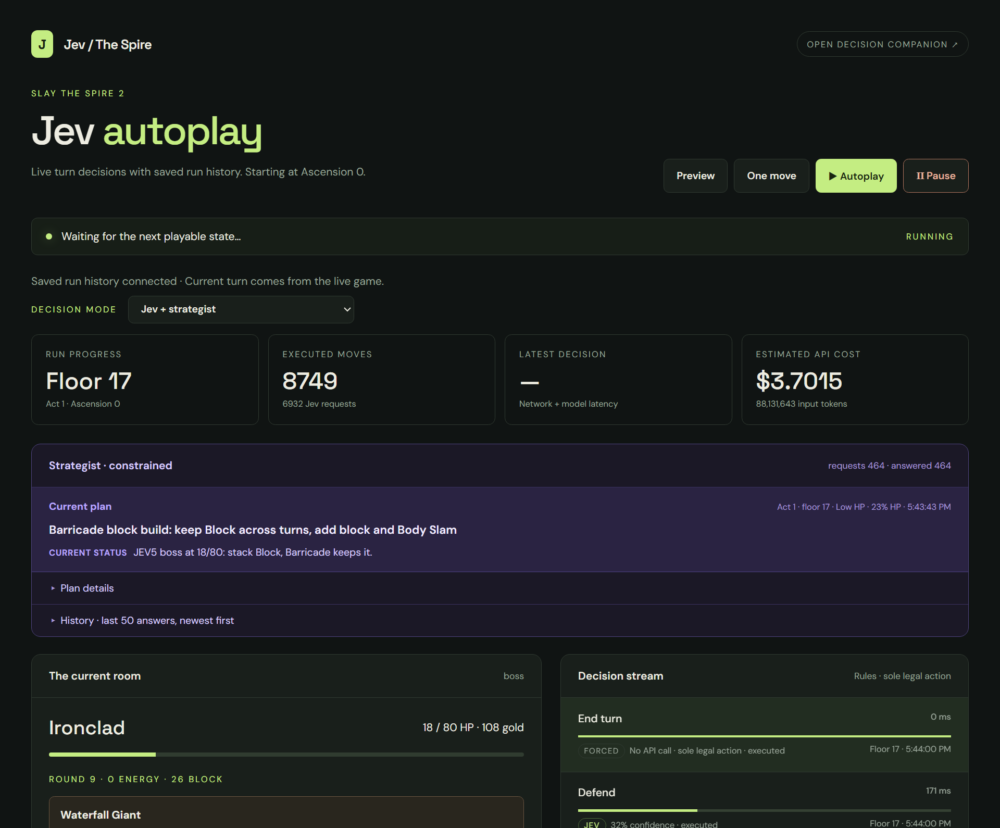

# Jev + Claude strategist for Slay the Spire 2

[](https://github.com/greenlittleapple/jev-game-lab/actions/workflows/test.yml)

An agent that plays Slay the Spire 2 through a local game bridge. [Jev](https://docs.typesafe.ai/api), TypeSafe's decision model (`jev-1.13.0`), picks every move from legal options that code builds out of the live game state. Claude, running in a Claude Code session, is a slower strategist: at set trigger points it writes a plan for the run and decides run-shaping screens such as card rewards, shops and rest sites. Deterministic rules between the two enforce that plan, and every move is checked against a fresh observation before it is sent.

It builds on [Jev the Spire](https://github.com/alexmeckes/jev-the-spire), where Jev plays alone. This repository adds the strategist layer, route and resource facts computed in code, enforced combat rules, cross-run memory, and moves that wait on the game's readiness instead of fixed delays.

<!-- results:start -->

**Results so far** (Ironclad, Ascension 0, standard runs): 2 wins, by Strategist v3.5 on seed JEV4 and Strategist v3.8 on seed JEV8. Of the 21 finished strategist runs, 5 reached the final boss on floor 48. Jev alone got no further than floor 28 in 11 runs.

<!-- results:end -->

## Progress by version

<picture>
  <source media="(prefers-color-scheme: dark)" srcset="docs/images/progress-dark.svg">
  
</picture>

<details>
<summary>The same data as a table</summary>

<!-- progress-table:start -->

| Version | Final floor of each run | What it added |
|---|---|---|
| Jev v1 (`jev-compact-v1`) | 17, 17, 17, 17, 17, 17 | One compact question per screen, no call for forced moves, reviews on risky end turns |
| Jev v2 (`jev-compact-v2`) | 14, 28 | Route and resource facts from code: elites, rests, shops, heal, potions and gold ahead |
| Jev v3 (`jev-compact-v3`) | 15, 7, 23 | Ordered route facts; second looks at hallway potion use and leaving a shop with gold |
| Strategist v2 (`claude-strategy-v2`) | JEV1: 33, JEV2: 48 | Claude writes the run plan at key moments; map moves follow its chosen act route |
| Strategist v2.1 (`claude-strategy-v2.1`) | JEV1: 17, JEV2: 48 | Enforced combat rules: no fatal play if one survives, potion HP floor, focus target |
| Strategist v3 (`claude-strategy-v3`) | JEV1: 17 | Claude picks rewards, shop buys, events and rest sites; fight plans saved per encounter |
| Strategist v3.1 (`claude-strategy-v3`) | JEV1: 17 (replay) | Forecasts for exhaust and finishing cards like Fiend Fire; forecast wins are taken |
| Strategist v3.2 (`claude-strategy-v3`) | JEV1: 17 (replay) | No ending a turn with a playable Beckon; least HP loss while enemies are Intangible |
| Strategist v3.3 (`claude-strategy-v3`) | JEV1: 33 (replay) | Moves wait for the game's ready signal instead of fixed delays (about 4x faster) |
| Strategist v3.4 (`claude-strategy-v3`) | JEV1: 48 | Briefs add enemy patterns, past card picks and fight results; potions saved for bosses |
| Strategist v3.5 (`claude-strategy-v3`) | JEV3: 33, **JEV4: won (floor 48)**, JEV5: 17 | A second look when Jev's line loses far more HP than the best surviving line |
| Strategist v3.6 (`claude-strategy-v3`) | JEV6: 17 | Win forecasts distrust unmodeled debuffs; the boss potion reserve yields at low HP |
| Strategist v3.7 (`claude-strategy-v3`) | JEV7: 33 | No healing potion that would mostly overheal; route plans start fresh each run |
| Strategist v3.8 (`claude-strategy-v3`) | **JEV8: won (floor 48)**, JEV9: 33 | Incoming-damage forecasts account for Weak and Vulnerable; costly forced plays yield |
| Strategist v3.9 (`claude-strategy-v3`) | JEV10: 42 | Frantic Escape forecast; a forced escape yields when it dies and a block line survives |
| Strategist v3.10 (`claude-strategy-v3`) | JEV11: 17 | Hallway potions only when the turn would drop HP under the floor; Paper Cuts forecast |
| Strategist v3.11 (`claude-strategy-v3`) | JEV12: 17 | Potions with effects the forecast can't show stay usable; briefs name a small draw pile |
| Strategist v3.12 (`claude-strategy-v3`) | JEV13: 25 | Fixes for multi-page events and transform screens; no play that starves a held Beckon |
| Strategist v3.13 (`claude-strategy-v3`) | JEV14: 17, JEV15: in progress (floor 7) | Orichalcum forecast; route facts give the fewest elites before the first rest |

<!-- progress-table:end -->

Strategist versions from v3 onward share the `claude-strategy-v3` policy label in the logs; the run series file tells the point releases apart.
</details>

## Speed

<picture>
  <source media="(prefers-color-scheme: dark)" srcset="docs/images/pace-dark.svg">
  
</picture>

Jev the Spire waits a fixed 1.2 s after each move, 0.7 s for the screen to settle, and up to 0.6 s per loop tick. Here the bridge reports `ready` when no game action is executing, the action queues are empty and player input is enabled. Once it is, the runner only confirms the screen is unchanged after 60 ms in combat or 250 ms elsewhere, then decides. On the same machine and game, the median time per move dropped from about 2.5 s to about 0.6 s. A Jev call itself has a median of about 0.2 s. Strategist consults are slower and are not what these medians measure; they happen only at trigger points.

## How it works



- **Bridge mod** (`integration/sts2-bridge`, adapted from [STS2MCP](https://github.com/Gennadiyev/STS2MCP)). Exposes the hand, draw/discard/exhaust piles, enemies and intents, map, rewards, events and shop over localhost HTTP, along with the readiness flag and cards known to be on top of the draw pile. Single-player only; browser-origin requests are rejected.
- **Runner** (`vendor/jev-the-spire/spire-demo/server.mjs` and `integration/sts2/`). Builds every legal action and short combat lines with one-turn forecasts (damage, block, HP loss, kills), computes route and resource facts (elites, rests and shops on each path, heal against missing HP, potions and gold against what is ahead), and joins the save checkpoint for run history.
- **Jev** answers one TypeSafe Choice request per decision, over the option IDs that remain after the rules. Forced moves and screens with a single remaining option skip the call.
- **Strategist.** Claude answers through a file channel (`npm run sts2:strategy -- wait | show | answer`) in the operator's Claude Code session. No Anthropic API key is used. Triggers include run and act start, elite and boss fights, every card reward, shop, event, rest site and treasure, a new relic, low HP, a normal fight with no saved plan, and mechanics the forecasts don't model. The plan is a fixed JSON schema: archetype and priorities, the act route as map node IDs, a fight plan and target order per encounter, a potion HP floor and boss reserve, and the exact options to take on the current screen.
- **Rules between them.** Options outside the plan are removed on its screens. Combat rules remove a play forecast to be fatal while a surviving one exists, take a forecast win when there is one, hold potions above the plan's HP floor in normal fights, keep the boss reserve, and follow the encounter's target order. Each rule leaves at least one option, and anything that executes goes through the same freshness check, pause control and dispatch log.
- **Memory across runs.** Fight plans are saved per encounter and reused, with the results of past fights against it. Strategist briefs also show each enemy's observed move sequence and how earlier picks of an offered card worked out.

The dashboard during the Act 1 boss fight of seed JEV5, with the strategist's current plan and the decision stream (each move is labelled as Jev's, forced, or the strategist's):



Why split it this way: in the five-run Jev-only baseline, Jev never took an optional elite (0 of 6), drank 14 of its 21 potions in normal fights, died with 161 to 329 gold unspent, and spread near-uniform probabilities over card rewards. Those are planning problems. A strategist answer takes far longer than a Jev call, so Claude is consulted only at trigger points (a few dozen times in a typical run) while Jev makes the hundreds of moves in between. The full design, rule list and trigger list are in [docs/STS2.md](docs/STS2.md#claude-strategy-layer).

## Limits

- The samples are small. Early strategist versions reused seed JEV1 (v3.1 to v3.3 replayed v3's non-combat choices on it); from v3.5 on, every run uses a new seed. The Jev-only runs used unseeded maps. The wins so far are not a win rate, and the comparison is indicative, not a controlled measurement.
- Ascension 0 only, Ironclad only. Stronger play at higher ascensions has not been shown.
- Runs were played on a modded install: mostly cosmetic and interface mods, plus Hextech Runes, which changes the game only when its run modifier is selected. Standard runs don't select it.
- Built and tested on Windows only.

<!-- cost:start -->

Jev used 1.0 to 3.2 million input tokens per Jev-only run and 1.1 to 7.4 million with the strategist, about $0.04 to $0.31 per run at TypeSafe's listed $0.042 per million input tokens (output is free). Claude's usage counts against the Claude Code subscription and is not measured here.

<!-- cost:end -->

## Running it

You need Slay the Spire 2 on Steam (tested on v0.111.0), the .NET 9 SDK, Node.js 22.18 or newer, a [TypeSafe API key](https://console.typesafe.ai/settings/keys), and Claude Code for the strategist.

1. Build the bridge against your game install, then quit the game and copy `integration/sts2-bridge/bin/Release/net9.0/STS2_MCP.dll` to the game's `mods` folder, and `integration/sts2-bridge/mod_manifest.json` there as `STS2_MCP.json`:

   ```powershell
   dotnet build integration/sts2-bridge/STS2_MCP.csproj -c Release "-p:STS2GameDir=<path to Slay the Spire 2>"
   ```

2. Copy `.env.example` to `.env` and set `TYPESAFE_API_KEY`.
3. Launch the game through Steam, then run `npm run sts2` (or double-click `Jev STS2.cmd`) and open http://127.0.0.1:4317. Choose the decision mode on the dashboard; the runner starts paused.
4. From the game's main menu, start a seeded run and hand it to the runner: `npm run sts2:start -- --mode claude --seed JEV1`.
5. For strategist mode, open this folder in Claude Code and ask it to act as the strategist. `AGENTS.md` points it to the request loop.

`npm run sts2:scorecard` summarizes every logged run, and `npm run sts2:progress -- --refresh` rebuilds the charts above from the local logs. Logs, saves and the key stay in the ignored `.private/` folder and `.env`. Setup details, controls and recovery steps are in [docs/STS2.md](docs/STS2.md); verification evidence is in [docs/STS2-VERIFICATION.md](docs/STS2-VERIFICATION.md).

## Repository layout

| Path | Contents |
|---|---|
| `integration/sts2/` | Strategist layer, triggers and plan schema, route facts, combat rules, playbook, scorecard, charts |
| `integration/sts2-bridge/` | Bridge mod (C#), adapted from STS2MCP |
| `integration/sts2-draw-tests/` | .NET harness for the draw-pile tracker |
| `vendor/jev-the-spire/` | Jev the Spire's runner, planner and dashboard, modified to load the strategist layer |
| `docs/` | Setup and design (`STS2.md`), verification records, chart data |
| `src/`, `docs/WORKSHOP.md` | A separate game-independent harness and offline demo |

## License and credits

MIT, see [LICENSE](LICENSE). The vendored components keep their own MIT license files:

- [Jev the Spire](https://github.com/alexmeckes/jev-the-spire) (MIT, Jev The Spire contributors), imported at commit `8bab787` under `vendor/jev-the-spire` and modified.
- [STS2MCP](https://github.com/Gennadiyev/STS2MCP) (MIT, Yikun Ji), adapted under `integration/sts2-bridge`.
- [TypeSafe agent skill](https://github.com/typesafe-ai/skills) (MIT) under `.agents/skills/typesafe-ai`.

Not affiliated with Mega Crit, TypeSafe or Anthropic. Slay the Spire 2 and its content belong to their owners; no game files are included.
